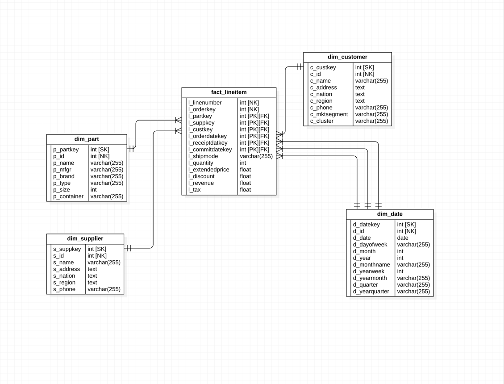

## The small ETL project
#### Requirements 1 and 2
1. Data was generated using the `bonus_etl_data_gen.txt`
2. There's an instruction in the README.md file to replicate and run this project on your machine.

#### Requirements 3 and 4: Star Schema
Here, I removed the partsupp table entirely to simplify the model and to make it easier to declare the 
grain for the fact table,
I also removed other candidates for dimension in the lineitem table that's not
relevant to our business use case.


#### Bonus Points
1. I created a cluster attribute in the dim_customer table,
the logic was based on their percentile standing among other customers,
and are defined as follows:
   * Bronze Customers – Those who are in the first 50 percentile.
   * Silver Customers – Those who are between the 50th and the 75th percentile.
   * Gold Customers – Those who are above the 75th percentile.

2. The revenue was calculated using the ff. formula:
```
revenue = (quantity * extended_price) - (discount * extended_price)
```

3. I haven't impelented my idea here, and chose to do it as part of future improvements.
But the idea is to shift the median/mean of the dates to be centered at the previous' year.
The pseudocode can be:
   1. Convert the dates to unix timestamp
   2. Calculate the mean or median of those timestamps, depending on data knowledge, but we can use the 
      mean for now.
   3. Measure the distance between each dates versus the mean date ie.
        * ```x_i - mean_x``` for all i in the dataset.
   4. In our use case we are interested in the dates 
      past 2 years, so we can use this to define our new center date which is 2020-06-15 for our use case.
   5. Use the distance and our defined center date to shift the old dates' distribution.
        * ```old_timestamps + convert_to_timestamp(new_date)```
   6. This will give us date range values that can be either above the mean, or below the mean.

### Scheduling the Process
* The project uses airflow for orchestration, and we can set there the frequency of
pipeline runs ie. by using cron pattern
  
### Mitigating Random Data Arrival/Order
* If we have a streaming use case, we can do two 2 things:
    1. Design the pipeline such that it's idempotent to reprocess the data, ie.
    using staging distributed storages / or by using pure python functions.
    This way, we can configure our pipeline to reprocess the data inside the staging storage, ie. by using 
       the Lambda Architecture where we have a speed layer that has the possibility to consume
       late data, and another one is the batch layer, which will catch the computation for the late data.
    2. Use Spark Watermark ie. we can define the latency that we want to tolerate.
    This will work if we're going to use window based processing and if we've defined a
       watermark column in our aggregates. 
       
    For example if we have an event data that arrives at 10:15, and all other
    events related to it came only after 1 hour (at 11:15). If we defined a watermark
    of say 2 hours, our pipeline will still consider those events that are not older than
    9:15. It means, data between 9:15 and 11:15 are considered as micro-batches, thus, 10:15's events will 
    be considered as on time.

### Dockerize Implementation
* The project uses docker to containerize airflow and our databases, please check README.md file for more info

### Data Profiling
* Data profiling tools will depend on the size of the data and the business requirements.
For small to mid size data, I will use pandas data profiling, although it's limited to Column profiling.
For mid to large scale data, I will use Alteryx or Talend.
* For techniques, I'll be looking on the following:
    - Data anomalies - are there values that we think are suspicious?
    - range of values - what is the acceptable range of values for Column Y? for Column N?
    - Frequency - frequency distribution of Column X? Column Y? do we have more data coming from Europe vs.
      Asia?
    - data / variable type - how can we classify Column X? Is it a Continuous Variable or a Categorical Variable?
    - Missing values - how many missing values are acceptable in Column X?
    - Cardinality - (relationship) how many unique values do we have for Categorical Column Z?
    do we have a 1 -> many relationship(s)?
    - Distribution of data - do we have normal distribution for column x? do we have a log-normal distrubtion?
      If we're using mathematical models that requires normal data, then checking the distribution of the 
      data can be useful.
* Data profiling will help us define our expectations to our data, as a best practice we should explore the 
  data before creating our data pipeline.
    - For instance, if we identified that there's an increasing amount of data coming
    from the users that resides at Europe, therefore we can configure our cloud stores / servers
    to be located near Europe.
    - Also. we can identify how many times we need to validate our data, and in 
    which layer of the pipeline. ie. We know that the data coming from Source_A
    has a standard deviation of 1.5, therefore we can add a data validation just
    near to that.
    - In terms of security, we can identify which data should be protected / hashed.

### Production Environment and Scalability
  What would be your recommendations in terms of tools and process?
  
  * Depending on the requirements,
  In terms of tools, instead of using pandas, I'll use distributed processing frameworks
  like spark, AWS EMR or AWS Lambda. This will help us scale our pipeline easily if we have that in our requirements.
  We can add more nodes in our spark cluster easily in just few click, if we want to process n-times 
  amount of data.


  * For the staging storage, instead of using MySQL database, I will use distributed storage like S3,
  which is also horizontally scalable. This will avoid bottlenecks in our processing framework, for
  eg. Spark, thus, utilization of distributed processing.
  
  * For orchestration framework, I'll use Cloud watch to trigger the pipeline jobs for simplicity.
   We can also use Airflow here, and I can talk about it if needed.

  * For the data warehouse store, I'll pick a columnar database like Redshift which was
    optimized for analytics and aggregation, also good performance for read-heavy workloads.
    It can also tolerate late data, ie. if we have late data from a dimensional attribute in which our fact 
    table depends on. We can decide proceed it to Redshift instead of isolating it for later processing, this is 
  because redshift does not enforce constraints. Also, I used Postgres in my current build, so migrating
  knowledge base as well as our resources won't be a painful process.
  
  
  
  