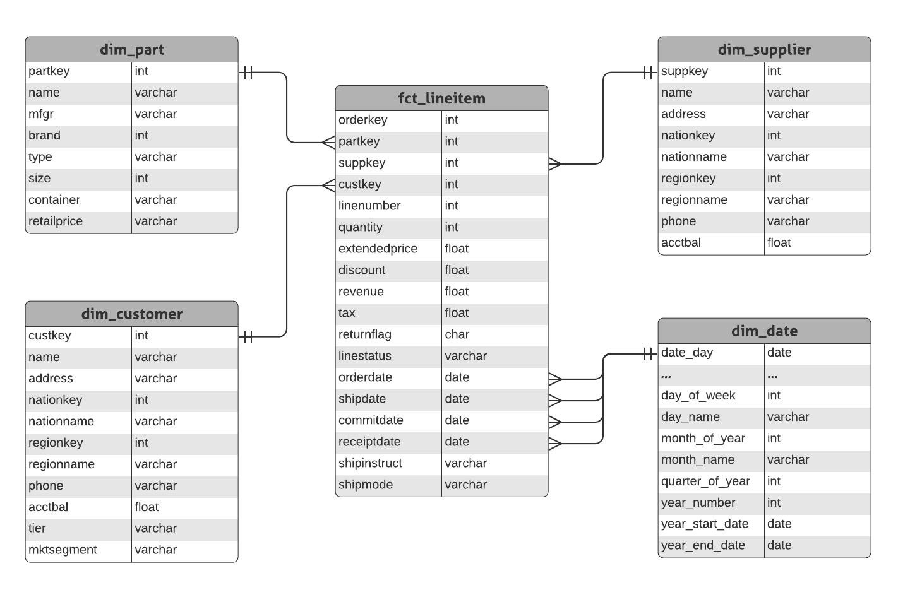

# Data Engineer Interview Test

## Tools and technologies
- [Meltano](https://meltano.com/) - very convenient open source tool for building pipelines with:
  - [Singer](https://www.singer.io/) taps and targets - ready-to-use extract and load scripts
  - [dbt](https://www.getdbt.com/product/what-is-dbt/) - transform data with simple SELECT statements and Jinja templating
  - Apache Airflow - the one and only
- [Apache Superset](https://superset.apache.org/) - "open source Tableau" (also comes with a useful SQL editor for ad hoc queries)
- PostgreSQL
- Docker and docker-compose

## ETL (ELT, really)
1. The data for this exercise can be found on the `data.zip` file. Can you describe the file format?
    - They seem to be flat files delimited by pipe characters. Each line has a trailing pipe.

- **Super Bonus**: generate your own data through the instructions on the encoded file `bonus_etl_data_gen.txt`.
To get the bonus points, please encode the file with the instructions used to generate the files.
  - [Done](https://github.com/mkdlt/dataengineer_test/blob/master/bonus_etl_data_gen_answer.txt) ✅. File was encoded in base64.

2. Code your scripts to load the data into a database.
    - Meltano, building on Singer, makes this very simple. Most of the work goes into [configuration](https://github.com/mkdlt/dataengineer_test/blob/master/meltano/meltano.yml).
```
$ meltano add extractor tap-spreadsheets-anywhere
$ meltano add loader target-postgres --variant meltano
$ meltano elt tap-spreadsheets-anywhere target-postgres
```
3. Design a star schema model which the data should follow.
 


4. Build your process to load the data into the star schema
    - See [this directory](https://github.com/mkdlt/dataengineer_test/tree/master/meltano/transform/models/star). Again, dbt makes the transform step relatively painless.

- **Bonus** points: 
  - add a field to classify the customer account balance in 3 groups. [Done](https://github.com/mkdlt/dataengineer_test/blob/master/meltano/transform/models/star/dim_customer.sql) ✅
  - add revenue per line item. [Done](https://github.com/mkdlt/dataengineer_test/blob/master/meltano/transform/models/star/fct_lineitem.sql) ✅
  - convert the dates to be distributed over the last 2 years. (to do)

5. How to schedule this process to run multiple times per day?
 
**Bonus**: What to do if the data arrives in random order and times via streaming?

6. How to deploy this code?

**Bonus**: Can you make it to run on a container like process (Docker)? 
