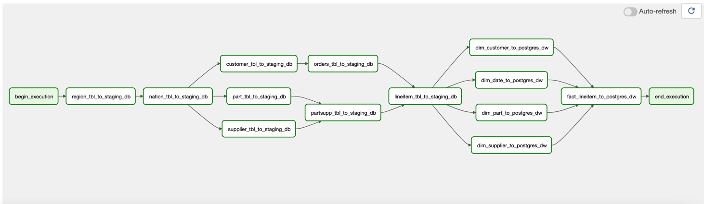
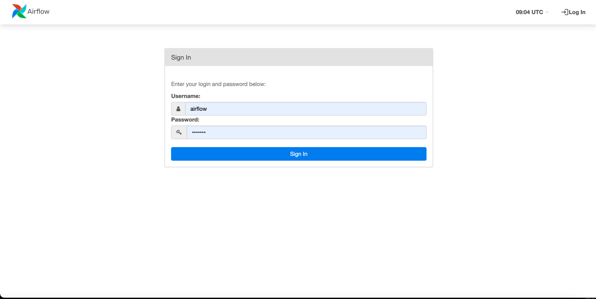
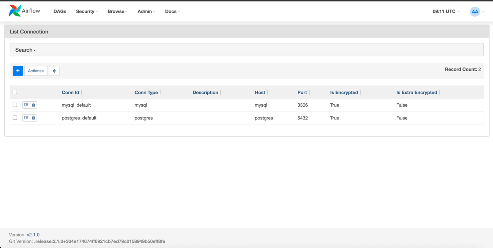
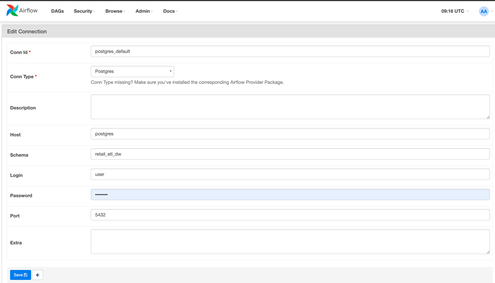

# Retail ETL

In this project I used Spark which was installed in localhost where Airflow also resides,
but ideally we can use Azure Databricks or AWS EMR in the production environment for Spark,
and Airflow ....

[](https://travis-ci.com/1byte-yoda/gs-news-app)

<!-- PROJECT LOGO -->
<br />
<p align="center">
  <!-- <a href="https://github.com/PHmark/gs-news-app">
    
  </a> -->
  <h3 align="center">Retail ETL</h3>
</p>

<!-- TABLE OF CONTENTS -->
## Table of Contents

* [About the Project](#about-the-project)
  * [Built With](#built-with)
* [Getting Started](#getting-started)
  * [Prerequisites](#prerequisites)
  * [Installation](#installation)
* [Workflow](#workflow)
* [Contact](#contact)

<!-- ABOUT THE PROJECT -->
### About The Project
This Batch ETL pipeline aims to parse semi-structured data like .tbl files,
stage it to a MySQL database, and then load it to a Star Schema
which resides on a PostgreSQL database.

#### General Architecture


#### DAG Representation



#### Technology Stack Used

* [Python 3](https://www.python.org/)
* [Airflow](https://www.airflow.org/)
* [Docker](https://www.docker.com/)
* [PostgreSQL](https://www.postgresql.org/)
* [MySQL](https://www.mysql.com/)


#### Network Configurations Used
* Airflow: running on `localhost` at port `8282` 
* PostgreSQL: running on `localhost` at port `5432`
* MySQL: running on `locahost` at port `3306`


### Prerequisites
For an easy setup, the installation of this project only requires docker and docker-compose which can be 
downloaded from the following links:
* [Docker](https://docs.docker.com/get-docker/)
* [Docker Compose](https://docs.docker.com/compose/install/)

Although, for development environment, like running tests & stuff, you will need to install
Python3 and the pacakges inside the `requirements-dev.txt` file.

Just take note that this project was tested and developed using Python 3.9.1, please check if you have the 
right version installed.
```
$ python --version
Python 3.9.1
```

### Installation
Once you have the requirements above, you can clone and spin up the project with ease.
1. Clone the repo
```sh
$ git clone https://github.com/1byte-yoda/dataengineer-test
````

2. This step is crucial, go to the project's root directory and follow the instructions inside the data_gen.
   txt file.

3. Make sure you've done the previous step, if so, you can spin up the docker containers with the 
   following command.
   
```
$ docker-compose up --build
```

4. This step is optional, and is required for development setup.
```
$ pip install -r requirements-dev.txt
```

5. Accessing the Airflow Web UI.
  * Airflow was set up to run at http://localhost:8282, kindly check this link, airflow must be up and 
    running. You'll be prompted to log-in.
    * Default credentials for airflow:
      * `username: airflow`
      * `password: airflow`
    * Although these information can be modified inside .env file.
  
#### Airflow's Login Page


6. This additional step was needed before you can run the project,
    * Add the connection details / credentials for PostgreSQL and MySQL databases.
    * Link to connection setup page http://localhost:8282/connection/list/, go to this link.
    * On the top-left area of the UI, you'll find a + (plus sign), click it to add services / configurations.

#### Airflow's Connection List Page


#### MySQL Configuration


#### Postgres Configuration


#### Important
Please use "*password*" as your password for Both MySQL and Postgres configs. 

### Running Useful Commands for Development
Running the test suites:
```
$ make test
```

Formatting the whole code base following the `black` code style:
```
$ make black
```

Checking for lints / un-obvious code mistakes:
```
$ make lint
```

Checking the test coverage of the project.
```
# Prints the coverage output in the CLI.
$ make cov_report

# Saves the coverage output in a readable, HTML format.
$ make cov_report html 
```

#### TODO:
* Add Travis CI
* Add copy command for ddl.sql in data_gen.txt
* Clean up docker-compose's variables with sensitive information
* Setup Spark in Airflow's connection config [insert image]
* Setup Mysql in Airflow's connection config [insert image]
* Airflow plugins must use airflow variables when referring to a file.

#### Dev Notes:
* All data source tables are created upon docker starts
* You can change the logging level by modifying the AIRFLOW__CORE__LOGGING_LEVEL variable
in the docker-compose.yml file


### Common Errors
* Volume data was not found by docker-compose
    * Make sure you already ran the data_gen.txt command.
    * If that's not the case, run docker system prune -a to clean up docker images, then build the 
      containers again
* pytest throws docker.errors.APIError
    * This is due to unstable network connection with the docker server,
      try running the test again.
    * Make sure airflow and other dependent services are down by running:
    `docker-compose down`, then run the test again
      